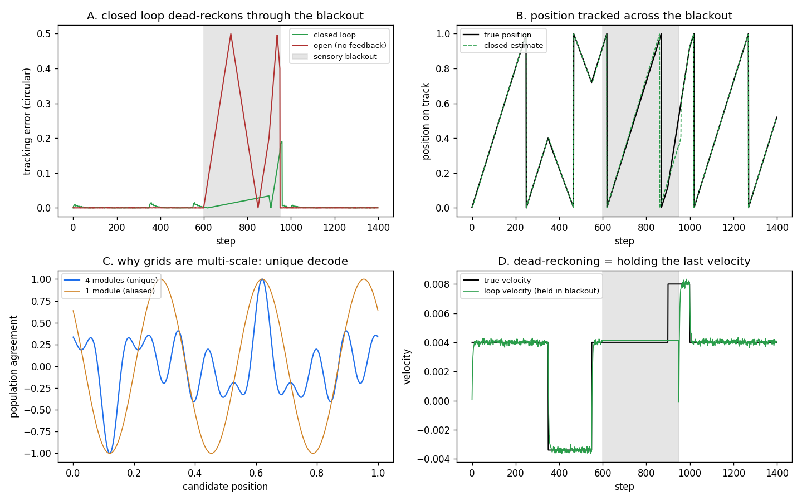

# Cortical Loop — closing the geometric-neuron stack into a hippocampal circuit

EDIT: Added Grid discovery. A sort of self discovering enthorhinal grid cortex system. 

> *Do not hype. Do not lie. Just show.*

**PerceptionLab / Antti Luode (Helsinki), with Claude (Opus 4.8). June 2026.**

A runnable model of the entorhinal–hippocampal loop, built by adding the one edge
that turns a feed-forward readout stack into a recurrent, path-integrating circuit:
the **arrow feeds back to drive the grid**. With that edge the system dead-reckons
through a sensory blackout; without it, it goes blind. Pure numpy.



---

## 1. What changed — the closure

Across the prior work the layers were built open-loop: signal → power / frequency /
arrow → store. The hippocampal signature is the *loop*, and its defining move is path
integration. The missing edge is one line:

```
arrow (signed velocity)  ──►  grid (advance the phase)
```

The arrow stops being a passive readout and becomes a **velocity** that integrates the
grid's position estimate forward. When sensory input is present, a CA1 comparator
corrects the estimate against reality in the theta window. When input drops out, the
loop holds its last velocity and keeps integrating — dead-reckoning. That is the whole
point of a loop over a stack.

## 2. The biological map (function, not identity)

| component | biology | in `cortical_loop.py` |
|---|---|---|
| grid modules `k_m` | MEC grid / band cells | phase estimate `Phi_m`, advanced by velocity |
| arrow → velocity | optic-flow / speed cells; phase precession | `angle(z(t)·z̄(t−1))/2πk` — the L2 bilinear, signed by quadrature |
| place readout | CA place cells (the grid "beat") | `decode()` — where all module phases agree |
| comparator | CA1 (predicted vs actual) | theta-gated phase correction |
| theta clock | medial septum + chandelier/AIS veto | correction only in the disinhibition window |
| bulk store | CA3 / DG | `island_net.py` (the pole-field memory, included) |

The map is a set of **functional homologies**, not a claim to be a hippocampus. See §5.

## 3. What running it shows (printed by the engine, not assumed)

A 1-D circular track, a trajectory with forward, **backward**, and fast segments, and a
350-step sensory **blackout** in the middle.

- **A — dead-reckoning through the blackout.** Mean tracking error: closed `0.0085`,
  open `0.0619`. *During* the blackout: closed `0.024`, open `0.247` — the open loop
  goes blind, the closed loop coasts on held velocity. This is the falsifiable
  signature of a loop vs a stack.
- **B — direction needs two channels.** The single-channel (direction-blind) arrow
  integrates the *wrong way* on the backward segment (error `0.29` vs the closed loop's
  `0.002`). The arrow-of-time/chirality result, now as a navigation failure: you cannot
  path-integrate from a scalar.
- **C — why grids are multi-scale.** Four incommensurate modules give a unique position
  decode; one module gives `287` aliased candidates. The multi-scale grid is what makes
  the decode unambiguous over a range far longer than any single wavelength.
- **D — the mechanism.** The held velocity during blackout is plotted directly: the loop
  freezes its velocity estimate and integrates it. That is dead-reckoning, visible.

## 4. Run it

```bash
pip install numpy matplotlib
python cortical_loop.py        # prints the scorecard, writes cortical_loop.png
```

The readout layers the loop sits on (`holographic_stack.py`) and the bulk
(`island_net.py`) are included from the lineage; the loop is self-contained.

## 5. Honest scope (what this is NOT)

- **1-D toy.** A circular track with grid-frequency-tuned quadrature sensors. The real
  target is the multichannel field; the structure carries over, the numbers won't.
- **Fixed bands.** The grid frequencies are set, not learned. Learning the basis is the
  `dynamic_geometric_net` story; the *nonlinear* dictionary (V1 growing its own Gabors)
  is still the open half of O1, and the biology does it where this does not.
- **Functional homology, not biology.** Real grid cells are a continuous attractor doing
  the integration; here the integration is explicit. Real phase precession is a
  single-cell + network phenomenon; here the arrow is a quadrature estimator. The lag /
  theta period are pinned to behavior and STDP in the brain and are free parameters here.
- **The CA1 correction is a simple proportional pin**, not a Bayesian filter. It works;
  it is not claimed to be optimal.

What is genuinely shown is narrow and real: **the closure path-integrates, holds a
percept through a blackout, and fails in exactly the ways the theory predicts** —
direction-blind without quadrature, aliased without multiple scales. The loop is the
thing; everything else in the lineage (the stack, the bulk, the blind-zone pole kernel)
is the substrate it runs on.

## Lineage

GeometricNeuron / SpectralIslands (the skew-island arrow) · dynamic_geometric_net (the
learned bands) · the holographic stack (power/frequency/arrow as symmetry classes) ·
IslandNet + the RH blind-zone pole kernel (the bulk) · and now the loop that wires them
into a circuit.

> *Do not hype. Do not lie. Just show — including the scope.*
